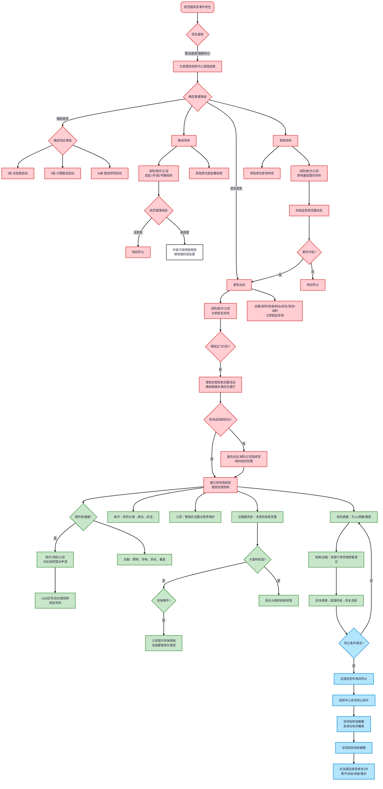

```mermaid
---
config:
      theme: redux
---
%% 牡丹江机场航空器突发事件应急响应与处置总流程图
%% 按照《4.响应与处置》全文结构绘制，三阶段+五级救援指令+三级响应

flowchart TD
%% ========== 先期处置阶段 ==========
start(航空器突发事件发生) --> info{信息接收}
info -->|塔台/航务/指挥中心| rep[立即报告指挥中心值班经理]
rep --> grade{确定救援等级}
grade -->|优先发布| gr1[紧急出动]
grade --> gr2[集结待命]
grade --> gr3[原地待命]
grade -->|稍后发布| resp{确定响应等级}
resp --> r1[I级 总经理启动]
resp --> r2[II级 分管副总启动]
resp --> r3[III级 值班领导启动]

%% ---- 紧急出动 ----
gr1 --> cq1[消防/医疗/公安<br>立即赶赴现场]
gr1 --> cq2[运输/安检/地保/航站/综合/安办/油料<br>立即赶赴现场]
cq1 --> pass1{需经过飞行区?}
pass1 -- 是 --> ctrl[管制员管控航空器活动<br>确保救援车辆优先通行]
ctrl --> site1{现场总指挥到位?}
site1 -- 否 --> temp1[最先到达消防/公安指挥官<br>临时组织处置]
site1 -- 是 --> siteCmd1[建立现场指挥部<br>值班经理协助]
temp1 --> siteCmd1

%% ---- 集结待命 ----
gr2 --> ass1[消防/医疗/公安<br>赶赴1号或2号集结地]
gr2 --> ass2[其他单位赶赴集结地]
ass1 --> ready1{航空器落地后}
ready1 -- 无异常 --> end1[响应终止]
ready1 -- 有异常 --> siteCmd2[升级为现场指挥部<br>按地面阶段处置]

%% ---- 原地待命 ----
gr3 --> stay1[消防/医疗/公安<br>原地着装蹬车待命]
gr3 --> stay2[其他单位原地待命]
stay1 --> mon[持续监控航空器动态]
mon --> adj{事件升级?}
adj -- 是 --> gr1
adj -- 否 --> end2[响应终止]

%% ========== 综合处置阶段 ==========
siteCmd1 --> scene[现场救援：灭火/疏散/搜救]
siteCmd1 --> med[医疗：检伤分类→救治→后送]
siteCmd1 --> pol[公安：警戒区设置与秩序维护]
siteCmd1 --> out{需外部增援?}
out -- 是 --> out1[医疗/消防/公安<br>向总指挥提出申请]
out1 --> out2[120/驻军/协议医院等<br>赶赴现场]
out --> log[后勤：照明、供电、供水、餐食]
scene --> cargo[地保/运输：旅客行李货物卸载登记]
cargo --> clean[现场清理→道面检查→恢复适航]

%% 联动现场（航站楼/公共区）
siteCmd1 --> pax[运输服务部：未受伤旅客安置]
pax --> delay{大面积航延?}
delay -- 是 --> delay1[启动大面积航延预案]
delay -- 否 --> sec{安保事件?}
sec -- 是 --> sec1[公安提升安保等级<br>加强要害部位管控]

%% ========== 后期处置阶段 ==========
clean --> term{终止条件满足?}
term -- 否 --> scene
term -- 是 --> T1[总指挥宣布响应终止]
T1 --> T2[指挥中心发布终止指令]
T2 --> T3[现场指挥部解散<br>各单位有序撤离]
T3 --> T4[总指挥部择机解散]
T4 --> T5[应急通话录音保存2年<br>事件总结/调查/善后]

%% 阶段配色
classDef pre fill:#FFCDD2,stroke:#D32F2F,stroke-width:2px
classDef main fill:#C8E6C9,stroke:#388E3C,stroke-width:2px
classDef post fill:#B3E5FC,stroke:#0288D1,stroke-width:2px

class start,info,rep,grade,gr1,gr2,gr3,resp,r1,r2,r3,cq1,cq2,pass1,ctrl,site1,temp1,siteCmd1,ass1,ass2,ready1,end1,stay1,stay2,mon,adj,end2 pre
class scene,med,pol,out,out1,out2,log,cargo,clean,pax,delay,delay1,sec,sec1 main
class term,T1,T2,T3,T4,T5 post
```